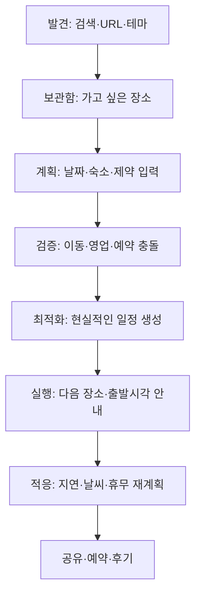
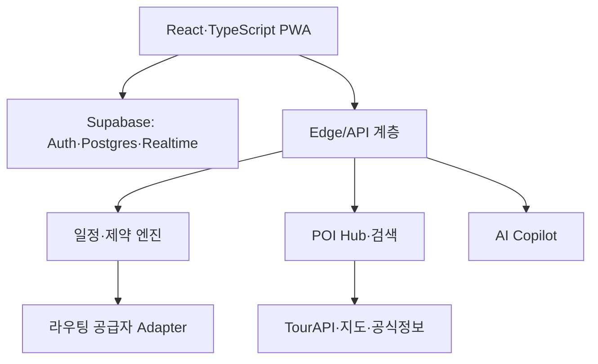

# Waymeld 통합 개선 개발계획

> Wayby · 마이리얼트립 · KoreaTravel Guru 비교분석 통합본  
> 작성 기준일: 2026-08-24  
> 개발 기준: 1인 개발자 + AI 코딩 보조, 24주 베타 출시 계획

---

## 0. 핵심 결론

Waymeld는 세 경쟁 서비스를 하나로 복제해서는 안 된다. 각각이 잘하는 역할은 다음과 같이 분명하다.

- **Wayby**: 장소를 빨리 모으고, 하루 동선을 단순하게 최적화하고, 함께 편집하는 경험
- **마이리얼트립**: 가격·재고·예약·결제·환불·CS가 결합된 여행상품 거래 인프라
- **KoreaTravel Guru**: 외국인이 이해하기 쉬운 한국 POI 큐레이션, 현지 맥락, 커뮤니티 기반 최신성
- **Waymeld가 차지해야 할 자리**: 여러 출처에서 발견한 장소를 실제로 실행 가능한 다일 일정으로 바꾸고, 여행 중 상황 변화에 맞춰 계속 재계획하는 서비스

따라서 권장 포지셔닝은 다음과 같다.

> **Waymeld — 가고 싶은 곳을 실제로 가능한 한국 여행으로 바꾸는 AI Travel Planning Workspace**  
> *From saved places to a Korea trip that actually works.*

Waymeld의 핵심 경쟁력은 ‘많은 장소’나 ‘많은 상품’이 아니라 다음 세 가지가 되어야 한다.

1. **Constraint-aware Itinerary Engine**: 영업시간·예약시간·체류시간·교통수단·식사·숙소·피로도를 함께 계산하는 일정 엔진
2. **Korea Travel Intelligence**: 공공 관광데이터, 지도 검증정보, 현지 이용 팁, 합법적으로 활용한 커뮤니티 신호를 통합한 POI Hub
3. **Adaptive Trip**: 비·휴무·지연·사용자의 현재 위치 변화가 생기면 이유를 설명하고 대안을 제시하는 여행 중 재계획

개발 우선순위는 **P0 일정 신뢰성 → P1 발견·설명 → P1 여행 중 적응 → P2 예약 제휴·커뮤니티** 순서로 둔다.

---

## 1. 세 서비스 통합 비교

### 1.1 경쟁 서비스의 역할

| 서비스 | 사용자가 해결하는 문제 | 확인된 강점 | Waymeld가 배울 점 | 그대로 따라 하면 안 되는 이유 |
|---|---|---|---|---|
| Wayby | “여러 장소를 어떤 순서로 갈까?” | Google·Naver·Kakao 장소검색, 실시간 공동편집, 순서고정, 원터치 최적화, 왕복 일정, 단순한 3단계 흐름 | 첫 사용의 단순함, 하단 고정 최적화 CTA, 잠금과 공유의 명확성 | 하루·약속 중심 경험과 정면승부하면 차별성이 약함 |
| 마이리얼트립 | “무엇을 얼마에 예약할까?” | 항공·숙소·투어·티켓, 실시간 가격, 결제, 후기, 파트너·CS·신뢰 | 일정 안에서 필요한 상품을 적시에 연결하고 예약상태를 표시 | 직접 거래 인프라를 만들면 재고·결제·취소·CS 부담이 급증 |
| KoreaTravel Guru | “한국에서 어디가 정말 갈 만한가?” | 외국인용 영어 맥락, 큐레이션 POI, 지역·테마 지도, 한국어명·주소, 지도 딥링크, 현지 팁, 사용자 제보·오류신고, Reddit 연결, 제휴 링크 | ‘왜 가야 하는지’와 ‘처음 온 외국인이 무엇을 알아야 하는지’를 POI 카드에 담기 | POI 디렉터리만 만들면 계획·실행이라는 Waymeld의 강점이 사라짐 |
| Waymeld 목표 | “가고 싶은 곳을 현실적으로 가능한 여행으로 만들고 현장에서 유지하기” | 다일 일정, 시간창·영업시간·숙소·교통·피로도, 설명 가능한 최적화, 실시간 재계획 | 세 서비스의 강점을 일정 실행 흐름 안에서 선택적으로 흡수 | 범위를 한꺼번에 넓히면 데이터 품질과 일정 신뢰도가 무너짐 |

Wayby는 공개 페이지에서 ‘장소 추가 → 최적화 → 공유’의 단순한 흐름과 순서 고정·왕복 최적화를 전면에 내세운다. [Wayby 공식 페이지](https://wayby.me/)  
마이리얼트립은 항공권·숙소·투어·액티비티 예약과 파트너·지원 체계를 핵심으로 운영한다. [마이리얼트립 공식 페이지](https://www.myrealtrip.com/)  
KoreaTravel Guru는 외국인을 위한 검수된 한국 장소와 현지 맥락, 사용자 제보·리뷰를 핵심 가치로 설명한다. [KoreaTravel Guru 소개](https://koreatravel.guru/about/)

### 1.2 기능 축별 통합 판단

| 기능 축 | 현재 선도 서비스 | Waymeld의 대응 전략 | 개발 시점 |
|---|---|---|---|
| 첫 사용 단순성 | Wayby | 로그인 전 샘플 일정과 3단계 온보딩 제공 | 1~2주 |
| 장소 다중검색 | Wayby | TourAPI + 지도사업자 검색을 하나의 검색창으로 통합 | 2~4주 |
| 하루 경로 최적화 | Wayby | 동일 수준 확보 후 시간창·다일·피로도까지 확장 | 4~8주 |
| 공동편집 | Wayby | 초기에는 공유 링크, 이후 실시간 편집·투표 | 3주 / 21주 |
| 상품·예약·CS | 마이리얼트립 | 직접 구축하지 않고 공식 파트너 API·딥링크 사용 | 22~24주 |
| 구매 신뢰 | 마이리얼트립 | 가격·예약 필요 여부·취소정책은 파트너 원문으로 이동 | 22~24주 |
| 한국 POI 큐레이션 | KoreaTravel Guru | 공공데이터·지도검증·자체 편집·사용자 제보를 통합 | 9~12주 |
| 외국인 실용정보 | KoreaTravel Guru | 한국어명·주소복사·지도앱 링크·예약·결제·에티켓 제공 | 9~12주 |
| 다일 일정 현실성 | 뚜렷한 선도자 부재 | Waymeld의 1차 독점 영역으로 집중 | 4~8주 |
| 여행 중 자동 적응 | 뚜렷한 선도자 부재 | Waymeld의 2차 독점 영역으로 집중 | 17~20주 |

### 1.3 반드시 지켜야 할 전략적 경계

1. **마이리얼트립과 거래 플랫폼 경쟁을 하지 않는다.** Waymeld는 계획·동선·시간을 맡고 예약업체는 가격·재고·결제·취소·CS를 맡는다.
2. **Wayby보다 기능 수를 늘리는 방식으로 경쟁하지 않는다.** Wayby의 단순성을 확보한 뒤 ‘다일·시간창·현장 재계획’으로 깊이를 만든다.
3. **KoreaTravel Guru를 포함한 경쟁 사이트를 크롤링하지 않는다.** 공개된 공식 API, 이용허락된 제휴 피드, 직접 편집, 사용자 제보만 사용한다. 마이리얼트립도 공식 페이지에서 무단 스크래핑을 금지하고 있다.
4. **LLM이 영업시간·가격·좌표·이동시간을 만들어내게 하지 않는다.** 사실 데이터는 출처 API가 담당하고 LLM은 의도 파악·요약·설명·대안 제시에 사용한다.
5. **초기에는 한국 인바운드 여행에 집중한다.** 글로벌 범용 플래너로 넓히기 전에 한국 3~7일 자유여행의 성공률을 높인다.

---

## 2. 목표 사용자와 핵심 사용 시나리오

### 2.1 1차 타깃

**처음 또는 두 번째로 한국을 방문하는 영어권 개별 자유여행객(FIT)**

- 3~7일 일정, 서울 중심 또는 서울+부산/강원/제주
- 대중교통과 도보 비중이 높음
- Instagram·YouTube·Reddit·블로그·Google Maps 등 여러 곳에 장소를 저장함
- 한국어 상호명, 주소, 예약 방식, 휴무일, 이동시간을 한꺼번에 판단하기 어려움
- 계획 완료보다 ‘오늘 실제로 움직일 수 있는 일정’이 필요함

### 2.2 2차 타깃

- 한국인 국내 여행자와 친구·연인 소그룹
- 호텔·게스트하우스의 외국인 고객용 일정 추천
- 지역관광 조직·소규모 여행기획자의 공유 가능한 코스 제작

### 2.3 핵심 Job-to-be-Done

> “여러 사이트에 흩어진 가고 싶은 장소를 넣으면, 문 닫은 곳이나 무리한 이동 없이 내 취향과 예약시간에 맞는 일정으로 만들어 주고, 현장에서 늦거나 비가 와도 다음 행동을 바로 알려줬으면 좋겠다.”

### 2.4 제품 원칙

- **Useful before impressive**: 화려한 AI 문장보다 실행 가능한 일정이 먼저다.
- **Map and timeline together**: 지도와 시간표를 분리하지 않는다.
- **Explain every change**: 자동 변경은 이유·영향·되돌리기를 함께 제공한다.
- **Source visible**: 영업시간·예약·현지 팁의 출처와 확인일을 보여준다.
- **No dead end**: 갈 수 없는 일정에는 경고만 하지 말고 최소 2개의 대안을 제시한다.
- **Guest-first**: 가입하지 않아도 샘플을 만들고, 저장·공유 시점에 가입을 유도한다.

---

## 3. 목표 사용자 흐름



핵심 전환점은 다음과 같다.

1. 랜딩에서 **30초 이내 샘플 일정 체험**
2. 3개 장소 저장 시 **‘일정으로 만들기’ CTA** 노출
3. 날짜·숙소·속도·교통수단만으로 **초기 일정 생성**
4. 사용자가 반드시 가야 할 장소·예약을 **잠금**
5. 최적화 결과에 **변경 이유와 충돌 해소 내역** 표시
6. 여행일에는 **다음 행동 중심의 Live 화면**으로 자동 전환
7. 늦음·비·피로 시 **한 번의 선택으로 재계획**

---

## 4. 화면별 세부 개선안

### 4.1 랜딩·첫 진입

**문제**  
일반적인 ‘AI 여행추천’ 문구만으로는 Wayby, VisitKorea, 수많은 일정 생성 서비스와 차이를 이해하기 어렵다.

**개선**

- 헤드라인: “저장한 장소를 실제 가능한 한국 일정으로”
- 서브카피: “영업시간·이동시간·예약·날씨를 확인하고 여행 중에도 다시 맞춥니다.”
- CTA 2개: `샘플 일정 체험` / `내 여행 시작`
- 3단계 시각화: 장소 담기 → 현실성 검사 → 현장에서 재계획
- 서울 3일, 비 오는 부산 2일, 채식 서울 1일 등 즉시 복제 가능한 예시 일정
- 가입 전 1개 여행을 로컬 임시저장하고, 공유·기기간 저장 시 로그인 요청

**완료 기준**

- 신규 사용자가 설명 없이 60초 내 장소 3개를 담을 수 있음
- 랜딩→플래너 시작 전환율 25% 이상을 초기 목표로 설정

### 4.2 여행 생성 온보딩

한 화면에 많은 설문을 주지 않고 다음 3단계만 먼저 받는다.

1. **언제·어디**: 날짜, 방문 도시, 숙소 또는 시작·종료 지점
2. **어떻게**: 대중교통/도보/자동차, 걷기 허용량, 여행 속도
3. **무엇을 중요하게**: 관심사, 꼭 갈 곳, 식사·식단, 동행 특성

고급 옵션은 일정 생성 후 수정하도록 한다.

| 입력값 | 일정 엔진에서의 사용 |
|---|---|
| 숙소 | 매일 시작·종료 기준점, 왕복 여부 |
| 여행 속도 | 하루 최대 장소 수와 체류시간 버퍼 |
| 걷기 허용량 | 도보 전환과 대중교통 선호 가중치 |
| 식사·식단 | 식사 시간창과 음식점 필터 |
| 어린이·고령자·휠체어 | 계단·걷기·환승·휴식 페널티 |
| 꼭 갈 곳 | 제거할 수 없는 높은 우선순위 |
| 예약시간 | 변경 불가능한 하드 시간창 |

### 4.3 통합 계획 워크스페이스

**데스크톱 기본 구조**

- 좌측: 검색·보관함·추천
- 중앙: 날짜별 타임라인
- 우측: 지도·동선·상세정보
- 상단: 여행명, 날짜, 멤버, 저장상태, 공유
- 하단 고정 CTA: `일정 검사` / `동선 최적화`

**모바일 기본 구조**

- 지도 전체화면 + 확장 가능한 하단 시트
- 상단 날짜 탭
- 하단 주요 행동: 추가, 최적화, Live

**필수 상호작용**

- 보관함에서 날짜로 드래그
- 장소 사이에 `+`를 눌러 스마트 삽입
- `시간 고정`, `날짜만 고정`, `순서 고정`, `자유 이동` 4단계 잠금
- 최적화 전후 비교와 `되돌리기`
- 충돌 배지: 휴무, 도착 후 폐점, 예약 지각, 과도한 이동, 식사 누락
- 장소 카드에 도착·체류·출발·다음 이동시간을 한 줄로 표시

### 4.4 장소 검색·발견

- 검색창 하나에서 공식 관광정보와 지도 장소검색을 통합
- 동일 장소는 하나의 canonical place로 병합
- 검색 결과에 `지금 열림`이 아니라 **예정 방문시각에 영업함** 필터 제공
- 도시·동네·테마·소요시간·실내/실외·예약필수·영어친화·무장애·식단 필터
- 지도 범위 검색과 “현재 일정 사이에 넣기 좋은 장소” 제공
- URL 붙여넣기 → 제목·주소·좌표 후보 추출 → 사용자가 확인 후 저장
- 사용자 검색어가 한국어·영어 상호명 중 무엇이든 동일 장소로 연결

### 4.5 POI 상세 ‘Trust Card’

KoreaTravel Guru의 현지 맥락을 참고하되, 일정 실행에 필요한 정보로 재구성한다.

- 한국어명 / 영어명 / 한국어 주소 복사
- Google·Naver·Kakao 지도 딥링크
- 영업시간, 휴무일, 마지막 확인일, 데이터 출처
- 권장 체류시간과 방문하기 좋은 시간대
- 예약 필요 여부와 공식 예약 링크
- 가격대, 결제 유의사항, 대기 가능성
- 영어 대응, 접근성, 어린이·고령자 적합도, 식단 태그
- “왜 추천했는가”와 “현재 일정에 넣을 때의 영향”
- 여행자 팁은 출처 링크와 게시일을 표시하고 사실정보와 의견을 구분
- `정보가 달라요` 신고 및 관리자 검수 상태

### 4.6 AI Copilot

AI 대화창은 독립 챗봇이 아니라 일정 상태를 조작하는 보조 인터페이스로 만든다.

**지원 명령 예시**

- “비 오는 날은 실내 중심으로 바꿔줘.”
- “경복궁은 오전 10시에 고정하고 걷는 시간을 줄여줘.”
- “오늘 1시간 늦었어. 저녁 예약은 유지해.”
- “BTS 관련 장소를 한 곳 더 넣되 총 이동은 30분 이상 늘리지 마.”

**응답 형식**

1. 이해한 조건
2. 바뀌는 장소·시간의 diff
3. 변경 이유와 포기되는 항목
4. 적용 / 다른 안 보기 / 취소

AI가 직접 일정 DB를 무조건 수정하지 않고, 구조화된 변경안을 만든 후 사용자의 확인으로 반영한다.

### 4.7 Live Trip 화면

- 현재 위치, 다음 장소, 출발해야 할 시각, 예상 도착, 예약·티켓 바로가기
- `도착`, `건너뛰기`, `예정보다 늦음`, `더 머물기` 4개의 큰 버튼
- 지연 시 고정예약을 보호하면서 이후 장소만 재배치
- 비·폭염·한파 시 실내 대안과 이동 부담 감소안 제시
- 마지막 교통편 또는 영업 종료 위험을 우선 경고
- 데이터 연결이 약할 때 일정·주소·지도 딥링크·티켓을 오프라인 캐시

### 4.8 공유·협업

**1차**: 로그인 없는 읽기 전용 공유 링크, 복제, PDF/캘린더 내보내기  
**2차**: 초대링크 실시간 편집, 장소 투표, 댓글, 변경기록, 소유자 승인 모드

실시간 공동편집은 초기 핵심 엔진보다 늦게 개발하되, 공유 링크는 MVP에 포함한다.

---

## 5. 일정 엔진 설계

### 5.1 입력

- 날짜별 시작·종료 시각과 숙소
- 장소별 위경도, 영업시간, 권장 체류시간
- 교통수단과 출발시각별 이동시간
- 예약·공연 등 고정 시간창
- 반드시 방문 / 선호 / 선택 장소
- 여행 속도, 걷기 허용량, 식사시간, 휴식, 동행 특성
- 실내·실외, 날씨 적합성, 비용 범위

### 5.2 제약조건 구분

**하드 제약**

- 예약시간과 고정 일정
- 영업시간 안에 방문 완료
- 여행일 시작·종료시간
- 지정된 날짜와 필수 방문 장소
- 마지막 교통편 등 절대 제한

**소프트 제약**

- 총 이동시간 최소화
- 같은 지역을 묶어 역주행 감소
- 식사시간과 휴식 배치
- 선호도·테마 다양성
- 걷기·환승·하루 피로도 최소화
- 인기 장소의 혼잡 예상시간 회피

### 5.3 목적함수 예시

```text
총점 = 선호도 + 필수장소 충족 + 지역응집도
     - 이동시간 - 지각 - 영업시간 위반
     - 과도한 걷기 - 환승부담 - 일정과밀 - 연속 유사장소
```

가중치는 여행자 프로필에 따라 바꾼다. ‘여유롭게’ 사용자는 체류·버퍼를 높이고, ‘많이 보기’ 사용자는 장소 수의 가중치를 높인다.

### 5.4 구현 원칙

- 초기에는 2-opt/삽입 휴리스틱 + 시간창 검증으로 빠르게 구현
- 안정화 후 OR-Tools 등의 VRPTW 방식으로 확장
- 외부 Route Matrix로 실도로 이동시간을 받은 뒤 최적화
- 사용자가 장소 하나를 이동한 경우 전체를 다시 계산하지 않고 영향을 받는 구간만 계산
- 동일 출발·도착·모드·시간대 결과를 캐시
- 외부 라우팅 실패 시 직선거리 추정값은 ‘임시 추정’으로 명확히 표시

Google Routes API의 Route Matrix는 복수 출발지·도착지 간 거리와 시간을 제공하지만 요소 수만큼 과금되므로 캐시·시간대 버킷·증분 계산이 필수다. [Google Route Matrix 문서](https://developers.google.com/maps/documentation/routes/compute-route-matrix-over), [요금·제한 문서](https://developers.google.com/maps/documentation/routes/usage-and-billing)

### 5.5 일정 엔진 완료 기준

다음 테스트를 통과해야 한다.

- 서울 3일, 장소 15개, 숙소 1개, 고정예약 2개를 충돌 없이 배치
- 닫힌 장소가 있으면 숨기지 않고 사유와 2개 이상의 수정안을 제시
- 순서 잠금과 시간 잠금을 최적화 이후에도 보존
- 이동수단별 일정 결과가 분리되어 저장
- 최적화 이전·이후를 비교하고 1회 클릭으로 되돌림
- 캐시된 일반 일정은 3초, 외부 라우팅 호출 포함 시 8초 이내 결과를 목표

---

## 6. AI 기능 설계와 안전장치

### 6.1 LLM이 담당할 기능

- 자연어 여행요청을 구조화된 선호·제약으로 변환
- 후보 일정 2~3안의 성격과 차이 설명
- 출처가 연결된 후기·커뮤니티 의견 요약
- 일정 충돌 원인과 수정 이유를 쉬운 언어로 설명
- 한국어 장소명·주소·예약 방법을 외국인에게 이해하기 쉽게 안내
- 사용자의 현장 명령을 일정 변경 JSON으로 변환

### 6.2 LLM이 담당하지 않을 기능

- 좌표·영업시간·가격·재고·실시간 교통을 추측
- 출처 없는 장소 생성
- 예약이나 결제를 사용자 확인 없이 수행
- 고정 예약을 자동 삭제
- 커뮤니티 게시글을 원문 출처 없이 재사용

### 6.3 구조화 출력

```json
{
  "understood_constraints": [],
  "proposed_changes": [],
  "violations_resolved": [],
  "new_tradeoffs": [],
  "source_refs": [],
  "requires_confirmation": true
}
```

### 6.4 품질 검증

- 사실 필드에는 반드시 `source_id`와 `verified_at` 존재
- 생성 일정은 저장 전에 deterministic constraint checker를 통과
- 통과하지 못한 일정은 자동 적용하지 않고 수정안을 다시 생성
- 프롬프트·모델·알고리즘 버전을 `optimization_runs`에 기록
- AI 변경은 itinerary version으로 저장하여 언제든 복원

---

## 7. 데이터 전략: Waymeld POI Hub

### 7.1 데이터 소스 계층

| 우선순위 | 데이터 | 역할 | 처리 원칙 |
|---|---|---|---|
| 1 | 한국관광공사 관광콘텐츠·Open API | 공식 관광지·축제·이미지·다국어 기본정보 | 원본 식별자와 갱신일 보존 |
| 2 | Kakao/Google 등 지도 API | 좌표·주소·검색·길찾기 검증 | 각 사업자 약관과 표시요건 준수 |
| 3 | 시설 공식 홈페이지·예약 파트너 | 영업·예약·가격의 최종 확인 링크 | 핵심 사실은 원문 링크 제공 |
| 4 | Waymeld 자체 편집 | 외국인 실용 팁과 권장 체류시간 | 편집자·근거·검수일 기록 |
| 5 | 사용자 제보·후기 | 최신성·현장 맥락 | 신고·검수·신뢰도 체계 적용 |
| 6 | Reddit 등 커뮤니티 | 관심도와 의견 신호 | 공식 API·허용범위·출처 링크 사용 |

한국관광공사는 관광콘텐츠와 Open API를 제공하는 통합 플랫폼을 운영한다. [한국관광콘텐츠랩](https://conlab.visitkorea.or.kr/)  
Kakao Local API는 주소 좌표변환과 장소 관련 REST 기능을 제공한다. [Kakao Local API 문서](https://developers.kakao.com/docs/en/local/dev-guide)  
Reddit 콘텐츠는 작성자 소유이며 API 이용범위와 표시조건을 지켜야 하므로 무단 대량수집·상업적 재가공을 전제로 설계하면 안 된다. [Reddit Data API Terms](https://redditinc.com/policies/data-api-terms)

### 7.2 장소 통합·중복제거

1. 제공자 ID가 같으면 동일 장소
2. 한국어 정규화명 + 전화번호가 같으면 동일 후보
3. 정규화 주소 + 좌표 50m 이내이면 동일 후보
4. 지점명·층수·쇼핑몰 내부점포는 자동 병합하지 않고 검수
5. 충돌 데이터는 삭제하지 않고 출처별 값을 보존한 뒤 canonical 값을 선택

### 7.3 신뢰도 표시

각 사실정보에 다음을 저장한다.

- `source_type`: official / map / editor / community
- `source_url` 또는 provider ID
- `verified_at`
- `confidence_score`
- `valid_from`, `valid_to`
- 사용자 신고 수와 마지막 검수상태

사용자 화면에는 복잡한 점수 대신 `공식 확인`, `최근 지도 확인`, `커뮤니티 제보`, `확인 필요`로 표시한다.

---

## 8. 권장 기술 구조



### 8.1 권장 구성

- **프런트엔드**: React + TypeScript + Vite, 모바일 우선 PWA
- **서버상태**: TanStack Query, 로컬 편집상태는 Zustand 또는 동급 경량 상태관리
- **DB/인증/실시간**: Supabase Postgres, Auth, Realtime, Storage
- **공간검색**: PostGIS
- **서버 함수**: Supabase Edge Functions 또는 별도 Node/FastAPI
- **최적화**: 초기 TypeScript 휴리스틱, 이후 Python FastAPI + OR-Tools 분리 가능
- **관측성**: Sentry, 제품분석 PostHog 등
- **배포**: 현 Vite 배포를 유지하고 API 키·라우팅 호출은 서버 함수로 이동

Supabase는 Postgres를 기반으로 Auth·Storage·Realtime·Edge Functions를 결합할 수 있으므로 초기 소규모 팀에 적합하다. [Supabase Database 공식 문서](https://supabase.com/docs/guides/database/overview)  
클라이언트에 노출하면 안 되는 지도·AI 키는 Edge Functions 등 서버 계층에 두고 RLS를 적용한다. [Supabase 데이터 보호 문서](https://supabase.com/docs/guides/database/secure-data)

### 8.2 핵심 테이블

| 테이블 | 핵심 역할 |
|---|---|
| `places` | Waymeld canonical 장소, 이름·좌표·주소·기본 분류 |
| `place_sources` | 공급자별 ID·원본값·갱신일·출처 |
| `place_hours` | 요일·특정일 영업시간과 유효기간 |
| `place_facts` | 예약·식단·접근성·언어·실내외 등의 사실 |
| `place_verifications` | 편집·사용자 제보·검수 이력 |
| `trips` | 소유자, 날짜, 도시, 시간대, 속도, 교통 프로필 |
| `trip_members` | 소유자·편집자·조회자 권한 |
| `trip_days` | 날짜별 시작·종료·숙소·날씨 상태 |
| `trip_items` | 장소·예약·이동·메모와 시간·잠금·우선순위 |
| `route_segments` | 구간별 거리·시간·교통수단·공급자·계산시각 |
| `optimization_runs` | 입력 해시, 알고리즘 버전, 점수, 위반, 변경 diff |
| `itinerary_versions` | 적용 전후 일정과 복원 지점 |
| `user_preferences` | 언어·속도·걷기·관심·식단·접근성 |
| `content_reports` | 잘못된 장소정보 신고와 처리상태 |
| `affiliate_clicks` | 파트너·상품·일정 문맥·전환 추적 |

---

## 9. 기능 백로그와 우선순위

### 9.1 P0 — 12주 MVP에 반드시 포함

| ID | 기능 | 경쟁분석 근거 | 완료 기준 |
|---|---|---|---|
| P0-01 | 로그인 전 샘플 플래너 | Wayby의 낮은 진입장벽 | 60초 내 장소 3개 추가 |
| P0-02 | 여행·날짜·숙소 생성 | Waymeld 차별화 기반 | 다일 일정과 일별 시작·종료 저장 |
| P0-03 | 통합 장소검색 | Wayby의 다중검색, KTG의 POI | 최소 2개 공급자 결과 통합 |
| P0-04 | canonical POI·중복제거 | 데이터 오류 예방 | 상위 200개 샘플 95% 이상 정확 |
| P0-05 | 보관함·날짜 미지정 장소 | 발견→계획 연결 | 날짜 간 드래그·복구 가능 |
| P0-06 | 날짜별 타임라인+지도 | 핵심 워크스페이스 | 지도와 순서가 즉시 동기화 |
| P0-07 | 체류시간·고정시간·잠금 | Wayby 순서고정 확장 | 4단계 잠금 보존 |
| P0-08 | 교통수단별 Route Matrix | 현실 일정의 기반 | 거리·시간·출처·계산시각 저장 |
| P0-09 | 원터치 동선 최적화 | Wayby 동등 기능 | 잠금 보존, 변경 diff 제공 |
| P0-10 | 영업시간·예약 충돌 검사 | Waymeld 핵심 차별화 | 충돌 사유와 수정안 표시 |
| P0-11 | 일정 버전·되돌리기 | 자동화 신뢰 | 최적화 전 상태 1클릭 복원 |
| P0-12 | 자동저장·RLS | 기본 신뢰 | 사용자별 데이터 격리 |
| P0-13 | 읽기 전용 공유·복제 | 협업의 최소단위 | 비회원 조회·자기 계정 복제 |
| P0-14 | 캘린더·PDF·지도앱 연결 | 실제 실행성 | 시간·주소·링크 포함 내보내기 |
| P0-15 | 핵심 분석 이벤트 | 개선 근거 | 생성·저장·최적화·공유 funnel 수집 |

### 9.2 P1 — 13~20주 차별화 베타

| ID | 기능 | 목적 | 완료 기준 |
|---|---|---|---|
| P1-01 | 취향·속도·식단 온보딩 | 개인화 입력 | 모든 값이 엔진 가중치에 반영 |
| P1-02 | 자연어→제약조건 변환 | AI 진입장벽 감소 | JSON 검증 및 사용자 확인 |
| P1-03 | AI 일정 2~3안 생성 | 선택 가능한 개인화 | 각 안의 차이·희생 요소 표시 |
| P1-04 | 변경 이유·diff 설명 | 설명 가능한 AI | 적용 전 변경목록 확인 |
| P1-05 | POI Trust Card | KTG 수준의 맥락 | 출처·확인일·지도링크 제공 |
| P1-06 | URL→장소 저장 | 흩어진 발견정보 흡수 | 후보 매칭 후 사용자 확정 |
| P1-07 | 테마·지역 컬렉션 | 발견과 SEO 기반 | 일정으로 일괄 복제 가능 |
| P1-08 | 사용자 정보오류 신고 | 최신성 확보 | 신고→검수→반영 이력 보존 |
| P1-09 | 날씨 적합도·대안 | Adaptive Trip 기반 | 실외일정 경고와 실내 대안 |
| P1-10 | Live Trip | 계획→실행 연결 | 도착·지연·건너뛰기 처리 |
| P1-11 | 지연 기반 부분 재최적화 | 핵심 차별화 | 고정예약 보존, 이후 일정만 변경 |
| P1-12 | 오프라인 핵심정보 | 여행 현장 안정성 | 일정·주소·예약링크 캐시 |

### 9.3 P2 — 21주 이후 성장·수익화

| ID | 기능 | 목적 | 조건 |
|---|---|---|---|
| P2-01 | 실시간 공동편집·투표 | Wayby 수준 협업 | 충돌해결·활동로그 포함 |
| P2-02 | 공개 일정·SEO 페이지 | 유기적 유입 | 구조화 데이터·복제 CTA |
| P2-03 | 예약 파트너 딥링크/API | 거래 없이 수익화 | 공식 계약·가격 표시요건 준수 |
| P2-04 | 예약상태·바우처 보관 | 일정과 구매 연결 | 이메일 원문 자동수집은 별도 동의 |
| P2-05 | 커뮤니티 후기·추천 | 현지 신뢰 강화 | 신고·스팸·검수체계 선행 |
| P2-06 | 호텔·관광기관용 코스 위젯 | B2B 수익 | 소비자 PMF 이후 |
| P2-07 | 일본어·중국어 확장 | 인바운드 확장 | 영어 코어 품질 확보 이후 |

---

## 10. 24주 실행 로드맵

### 10.1 단계 요약

| 단계 | 기간 | 목표 | 주요 산출물 | 출시 게이트 |
|---|---:|---|---|---|
| 0. 기준선 | 1주 | 현재 기능·데이터·사용흐름 계측 | 이벤트 사전, 버그목록, DB 마이그레이션안 | 핵심 funnel 측정 가능 |
| 1. Planner Core | 2~5주 | 장소를 다일 일정에 안정적으로 배치 | POI 통합, 보관함, 날짜별 타임라인, 잠금, 공유 | 2일·8장소 수동 계획 성공 |
| 2. Reality Engine | 6~9주 | 현실적인 일정 자동 검증·최적화 | Route Matrix, 영업시간, 시간창, 충돌검사, 최적화 | 3일·15장소 테스트 통과 |
| 3. Trust & Discovery | 10~12주 | 외국인이 믿고 장소를 고름 | Trust Card, 출처, URL 저장, 테마 코스, 오류신고 | 핵심 POI 표본 정확도 95% |
| **MVP 공개** | **12주 말** | **계획 기능의 공개 검증** | **영어 우선 베타** | **활성화 사용자 50명 테스트** |
| 4. AI Copilot | 13~16주 | 자연어를 안전한 일정 변경으로 변환 | 선호 파싱, 2~3안, diff, 설명, 버전 | 제약 위반 자동적용 0건 |
| 5. Adaptive Trip | 17~20주 | 여행 중 상황변화 대응 | Live 화면, 날씨, 지연·건너뛰기, 부분 재계획, 오프라인 | 재계획 성공률 90% |
| 6. Collaboration & Growth | 21~24주 | 공유 성장과 초기 수익 검증 | 공동편집, 공개 템플릿, 제휴 딥링크, SEO | 공유·복제·제휴 funnel 측정 |

### 10.2 주차별 작업

| 주 | 개발 작업 | 검증 작업 |
|---:|---|---|
| 1 | 현 DB·화면 감사, 분석 이벤트, 오류수집 | 사용자 5명 현재 흐름 관찰 |
| 2 | `places`, `place_sources`, trips 계열 스키마 | 데이터 마이그레이션 샘플 |
| 3 | 통합검색·중복제거·보관함 | 서울 POI 200개 수동 표본검사 |
| 4 | 날짜별 타임라인·지도 동기화 | 모바일 드래그·삽입 테스트 |
| 5 | 잠금·자동저장·읽기 공유·버전 | 2일 일정 E2E 테스트 |
| 6 | 라우팅 공급자 Adapter·Matrix 캐시 | 비용·속도 측정 |
| 7 | 체류·영업·시간창 constraint checker | 휴무·지각 시나리오 30개 |
| 8 | 최적화 v1·왕복·숙소 시작종료 | 3일 일정 20세트 회귀시험 |
| 9 | 충돌 수정안·diff·PDF/캘린더 | 비회원 공유 실사용 테스트 |
| 10 | Trust Card·출처·검수일 | 외국인 이해도 인터뷰 |
| 11 | URL 저장·테마 컬렉션 | 5종 URL 매칭 정확도 검사 |
| 12 | 오류신고·MVP QA·성능개선 | 외부 베타 50명 시작 |
| 13 | 선호·제약 JSON 스키마와 자연어 파싱 | 모호한 요청 50개 평가 |
| 14 | AI 후보 일정 2~3안 | 모든 안 constraint 재검증 |
| 15 | 변경 diff·승인·취소·복원 | 잘못된 변경 복원 테스트 |
| 16 | 근거·출처 UI와 AI 품질게이트 | 환각·출처 누락 레드팀 |
| 17 | Live 화면·현재 상태 이벤트 | 도착·지연·건너뛰기 E2E |
| 18 | 날씨 적합도·실내 대안 | 비·폭염 시나리오 |
| 19 | 부분 재최적화·고정예약 보호 | 1~2시간 지연 시나리오 |
| 20 | 오프라인 캐시·PWA 안정화 | 저속·오프라인 현장시험 |
| 21 | 초대·권한·실시간 공동편집 | 동시편집 충돌 시험 |
| 22 | 투표·댓글·활동로그 | 악용·스팸 방지 점검 |
| 23 | 공개 일정·SEO·복제 CTA | 검색·공유 전환 측정 |
| 24 | 공식 제휴 딥링크·런칭 QA | 구매전환·표시요건 점검 |

### 10.3 가장 먼저 실행할 2주 작업

**1주차**

- 현재 화면의 사용자 행동 이벤트 정의
- `trip_created`, `place_saved`, `first_day_built`, `optimized`, `shared`, `live_started` 계측
- 3개의 대표 골든 일정 작성: 서울 3일, 부산 2일, 서울+춘천 3일
- 현재 데이터 구조를 canonical POI 구조에 매핑
- 랜딩과 플래너의 불필요한 진입단계 제거

**2주차**

- `places`, `place_sources`, `place_hours`, `trips`, `trip_days`, `trip_items` 구현
- 미배치 보관함과 날짜별 타임라인 구현
- 숙소·시작·종료지점 입력
- 시간/순서 잠금 데이터 모델 구현
- 모바일에서 장소 5개를 추가하고 날짜를 이동하는 E2E 테스트 작성

---

## 11. KPI와 출시 판단 기준

### 11.1 North Star Metric

**Weekly Activated Trips**  
한 주 동안 `장소 5개 이상 + 2일 이상 + 최적화 1회 + 공유/내보내기 또는 Live 사용`을 완료한 여행 수

단순 가입자나 AI 생성 횟수보다 실제 여행계획 완성에 가까운 행동을 측정한다.

### 11.2 초기 목표치

| 영역 | 지표 | 12주 MVP 목표 | 24주 목표 |
|---|---|---:|---:|
| 진입 | 랜딩→플래너 시작 | 25% | 35% |
| 활성화 | 시작→장소 5개 저장 | 45% | 60% |
| 핵심가치 | 장소 5개→최적화 | 55% | 70% |
| 완성 | 최적화→공유/내보내기 | 30% | 45% |
| 속도 | 첫 유용 일정까지 중앙값 | 10분 이하 | 7분 이하 |
| 품질 | 표본 일정의 하드 제약 위반 | 5% 이하 | 1% 이하 |
| 데이터 | 상위 POI 중복제거 정확도 | 95% | 98% |
| 안정성 | crash-free session | 99.0% | 99.5% |
| 적응 | 재계획 제안 적용률 | - | 40% 이상 |
| 성장 | 공유링크 방문→복제 | 10% | 20% |

목표치는 초기 제품 가설이며, 첫 50~100명의 행동을 보고 조정한다.

### 11.3 분석 이벤트

- `landing_sample_opened`
- `trip_created`
- `place_search_result_clicked`
- `place_saved`
- `place_assigned_to_day`
- `constraint_added`
- `optimization_started/completed/failed`
- `conflict_shown/resolved`
- `ai_change_proposed/accepted/rejected`
- `share_created/share_opened/trip_cloned`
- `live_started/delay_reported/replan_accepted`
- `affiliate_link_clicked`

---

## 12. 수익화 계획

### 12.1 1단계: 공식 예약 제휴

일정의 특정 시점에 필요한 상품만 문맥형으로 연결한다.

- 예약 필수 장소의 입장권·투어
- 숙소와 공항 이동
- 지역간 교통
- 음식점 예약
- 해당 날짜·지역 주변 숙소

마이리얼트립은 마케팅 파트너 API를 통해 실시간 항공·숙소·투어 가격 연동을 안내하고 있으므로, 크롤링 대신 공식 제휴 가능성을 검토할 가치가 있다. [마이리얼트립 API 가이드](https://docs.myrealtrip.com/), [마케팅 파트너 안내](https://partner.myrealtrip.com/welcome/marketing_partner)

**원칙**

- `광고/제휴`를 명확히 표시
- 추천순위와 수수료를 분리
- 가격·재고의 최종 책임은 파트너 페이지로 연결
- 사용자가 일정에 넣은 날짜·도시에 맞을 때만 노출

### 12.2 2단계: Freemium

**무료**

- 여행 2개, 기본 최적화, 공유, 제한된 AI 생성

**Waymeld Pro 후보**

- 여행 수 무제한
- 고급 제약조건과 여러 일정안 비교
- 실시간 Adaptive Trip과 오프라인 모드
- 고급 PDF·캘린더·여행 문서 보관
- 그룹 권한·변경이력

가격은 유료전환 인터뷰와 사용량·API 원가를 확인한 후 정한다.

### 12.3 3단계: B2B

- 호텔·게스트하우스용 지역 일정 위젯
- 지자체·관광기관의 공식 코스 빌더
- 여행 크리에이터의 브랜드 일정 템플릿
- 소규모 여행사의 고객별 일정 생성·공유 도구

소비자 핵심지표가 확보되기 전에 B2B 맞춤개발을 시작하지 않는다.

---

## 13. 주요 위험과 대응

| 위험 | 영향 | 대응 |
|---|---|---|
| 지도·라우팅 API 비용 급증 | 사용자 증가가 손실로 연결 | Matrix 캐시, 시간대 버킷, 증분계산, 일일 quota, 비용/활성여행 KPI |
| 영업시간 오류 | 일정 신뢰 붕괴 | 출처별 값 보존, 확인일 표시, 사용자 신고, 방문 전 재확인 |
| LLM 환각 | 존재하지 않는 장소·잘못된 일정 | POI ID 화이트리스트, JSON schema, constraint checker, 적용 전 확인 |
| 데이터 약관 위반 | API 차단·법적 위험 | 경쟁사 크롤링 금지, 공식 API·제휴·출처·삭제정책 |
| 기능 과다 | 핵심 완성 지연 | 12주 P0 동결, P1 기능은 출시 게이트 후 시작 |
| 실시간 공동편집 복잡성 | 데이터 충돌 | 초기는 읽기 공유, 후기는 권한·활동로그·충돌정책과 함께 개발 |
| 대중교통 라우팅 품질 편차 | ETA와 실제 일정 불일치 | 공급자 Adapter, 지역별 골든 테스트, 버퍼, 외부 지도앱 딥링크 |
| 커뮤니티 스팸·허위정보 | 신뢰 저하 | 후기 기능은 신고·검수·rate limit 이후 오픈 |
| 제휴 상품이 추천을 왜곡 | 사용자 신뢰 저하 | 일정 적합도 우선, 광고 표시, 자연 결과와 분리 |

---

## 14. 하지 말아야 할 개발

- 12주 MVP 전에 자체 항공·숙소·투어 결제와 취소 시스템 구축
- 대규모 후기 커뮤니티와 운영자 도구를 코어 일정 엔진보다 먼저 개발
- 경쟁사 페이지·상품·후기의 무단 수집
- 출처와 검증 없이 LLM이 장소·영업시간·가격을 생성
- 한국 여행의 품질을 검증하기 전에 전 세계 국가로 확대
- 일정이 불가능한데도 ‘AI 추천 완료’로 표시
- 지도·검색·AI API 키를 프런트엔드에 노출
- 공동편집·AI 변경에 버전·되돌리기 없이 DB를 직접 수정

---

## 15. 출시 전 통합 인수 테스트

### 시나리오 A — 첫 한국 방문자 서울 3일

- 장소 15개, 숙소 1개, 경복궁 고정, 저녁 예약 2개
- 대중교통, 하루 9시간, 보통 속도
- 영업시간과 이동시간을 지키면서 3일 배치
- 불가능한 장소는 이유와 다른 날짜 제안

### 시나리오 B — 비 오는 부산 2일

- 해변·야외 장소가 포함된 기존 일정
- 우천을 입력하면 실내 후보로 부분 교체
- 숙소와 열차 출발은 유지
- 변경 전후 이동시간과 포기 항목 표시

### 시나리오 C — 서울+춘천 3일 지연

- 지역간 이동과 마지막 열차 포함
- 첫 일정이 90분 지연된 상황
- 고정 열차·예약을 보호하고 선택 방문지를 제거 또는 이동
- 외부 지도앱으로 각 구간을 바로 열 수 있음

### 시나리오 D — 그룹 협업

- 3명이 장소를 제안하고 투표
- 소유자가 최종 잠금 후 최적화
- 동시에 수정해도 데이터가 유실되지 않음
- 이전 버전 복원 가능

### 최종 완료 정의

- 위 4개 시나리오의 핵심 흐름이 모바일과 데스크톱에서 통과
- 하드 제약 위반이 1% 미만
- 출처 없는 사실정보가 없음
- 공유받은 사용자가 가입 없이 일정을 확인 가능
- API 장애 시 오류 사유와 수동 대안 제공
- 분석 이벤트와 비용 모니터링이 동작

---

## 16. 최종 우선순위 한 장 요약

### 지금 만들 것

1. canonical POI와 통합검색
2. 날짜별 타임라인·숙소·보관함
3. 체류시간·잠금·고정예약
4. 실도로 Route Matrix와 캐시
5. 영업시간·예약 충돌 검사
6. 설명·되돌리기가 있는 원터치 최적화
7. 읽기 공유·복제·내보내기

### 그다음 만들 것

8. 외국인용 POI Trust Card
9. 자연어 선호·제약 입력
10. 검증된 AI 일정 2~3안
11. Live Trip과 지연·날씨 재계획
12. 오프라인 핵심정보

### 나중에 만들 것

13. 실시간 공동편집·투표
14. 공개 일정·SEO 템플릿
15. 공식 예약 제휴와 Pro 요금제
16. 사용자 후기 커뮤니티와 B2B 위젯

**Waymeld의 승부처는 추천 장소의 개수가 아니다. 사용자가 저장한 장소를 ‘오늘 실제로 움직일 수 있는 일정’으로 바꾸고, 현장에서 계획이 깨졌을 때 가장 빠르게 복구해 주는 것이 승부처다.**

