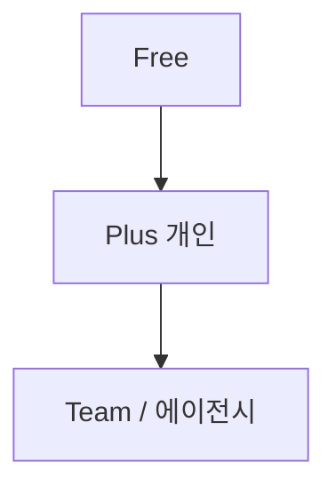

# WayMeld (여로담) 수익화 전략 분석

> 작성 기준: 2026-05-29  
> 출처: 다국어(i18n) 및 수익화 방향 계획, 코드베이스 구현 상태  
> 관련: [`src/lib/subscription.ts`](../src/lib/subscription.ts), [`src/components/UpgradeModal.tsx`](../src/components/UpgradeModal.tsx), [`supabase/migrations/20260529120000_profiles_subscription.sql`](../supabase/migrations/20260529120000_profiles_subscription.sql)

---

## 1. 핵심 결론 (한 줄)

**다국어 UI는 무료로 넓히고(유입·공유·입소문), 수익은 클라우드·일정 export·API 상한·에이전시(Team)에서 가져간다.**

여행 플래너는 언어 장벽만 낮춰도 공유·바이럴이 커지므로, **「영어 쓰려면 Pro」** 식의 언어 유료화는 이탈·스토어 기대와 맞지 않습니다.

---

## 2. 제품 포지션과 수익의 관계

| WayMeld 포지션 | 수익에 주는 의미 |
|------------------|------------------|
| 예약·결제 앱이 아님 (동선·일정 도구) | OTA·트리플과 **예약 수수료 경쟁 회피** |
| 검색 → 핀업 → 시간표 동선 → 공유 | **「진지하게 코스 짜는 사람」**이 Plus 전환 후보 |
| 카카오(국내) + Google(해외) 이중 지도 | 해외 사용자는 API 비용↑ → **Free 캡 + Plus 완화**로 정당화 |
| 공유 링크 · 공유마당 | UGC·템플릿 → **인바운드 유입** (다국어는 성장 레버) |

---

## 3. 추천 티어 구조

| 티어 | 가격 감각 (안) | 포함 | 다국어와의 관계 |
|------|----------------|------|-----------------|
| **Free** | 0원 | 로컬 저장, 기본 검색·핀·동선, 공유 링크(읽기), **모든 UI 언어** | 언어 = 성장 레버 (**잠금 X**) |
| **Plus** | 월 2,900~4,900원 또는 연 29,000원대 | Supabase 무제한 trip, 자동 동기화, PDF/이미지 일정 export(**선택 언어**), 실경로 동선 무제한, 광고 없음 | export·공유 페이지 locale = 체감 가치 |
| **Team** | 좌석당 월 9,900~19,900원 | Plus + 공동 편집(향후), 브랜드 로고, 고객 trip 템플릿, 화이트라벨 공유 링크 | 여행사·인플루언서 B2B |

---

## 4. 수익화가 i18n·제품과 맞물리는 지점

### 4.1 인바운드 코스 팩 (Plus 또는 일회성)

- 「서울 1일 / 제주 2일」 템플릿을 en / ja / zh로 제공
- 공유마당(`SharePlazaPage`)에 **locale 태그** + 필터 → 해외 사용자 유입
- DB: `waymeld_waymeld_trips.plaza_locale` (마이그레이션 반영됨)

### 4.2 API 비용 전가 (Plus)

- Google Places / Maps 호출이 많은 **해외·Google 지도 사용자**는 Free에서 일일 검색 캡
- Plus에서 상한 완화 → `mapProvider` google 사용량과 직결

### 4.3 공유 링크 프리미엄

- `/trip/:slug` + 방문자 UI 언어 자동 (`?lang=` / locale 라우트)
- Plus(향후): 커스텀 제목·커버·「WayMeld 제거」(에이전시 니즈)

### 4.4 B2B 라이선스 (Team)

- 호텔·렌터카·지자체: 임베드 위젯 + 정해진 locale 세트
- 한국어 카카오 동선 + 영문 Google 동선 **듀얼 브로슈어** 패키지

### 4.5 결제 인프라

- DB: `profiles.plan`, `subscription_status`, `subscription_expires_at`
- RLS로 trip 수·export 횟수 제한
- **MVP는 Plus 기능 1개(클라우드 무제한 또는 export)부터** 명확히 출시하는 것이 유리

---

## 5. 피해야 할 수익 모델

| 하지 말 것 | 이유 |
|-----------|------|
| UI 언어 자체를 유료화 | 이탈·리뷰 악화, 스토어 「free」 기대와 충돌 |
| POI 실시간 번역(DeepL 등) 전량 무료 | Google Places 비용 + 번역비 이중 부담 |
| 1차부터 10개 언어 | 유지비만 증가, 전환 검증 전 |
| 예약·결제·패키지 판매로 확장 | 트리플·마이리얼트립·OTA에 밀림 |
| 「AI가 다 짜줌」만 유료 포인트 | Wanderly·ChatGPT와 직접 비교 |

---

## 6. 타깃 세그먼트별 Plus 가치

| 세그먼트 | 왜 돈을 낼까 | Plus 킬러 기능 |
|----------|--------------|----------------|
| 여행 크루 리더 | 여러 기기·백업·공유 | 클라우드 동기화, export |
| 가이드·강사 | 발표·인쇄용 일정 | 다국어 export, 발표 모드(무료) + PDF(유료) |
| 인플루언서·블로거 | 팔로워에게 코스 배포 | export, (향후) 브랜딩 제거 |
| 해외 방문자 in KR | Google 검색·영문 일정 | 검색 캡 완화, en/ja/zh export |
| 여행사·학교 (Team) | 고객별 템플릿·좌석 | Team 시트, 화이트라벨 링크 |

---

## 7. 경쟁 대비 수익 포지션 (요약)

| 경쟁사 | 수익 모델 | WayMeld 차별 |
|--------|-----------|----------------|
| **Wayby** | (앱 내 구독·광고 추정) | 웹·로컬 즉시 시작, **다국어 export** |
| **Triple** | 예약·커머스 | 동선 도구만 — **예약과 분리** |
| **Wanderlog** | Pro 구독·협업 | 국내 카카오+해외 Google **한 앱**, 공유마당 |
| **카카오/구글 지도** | 광고·생태계 | **시간표 동선**·체류·점심 보정 |

**차별 한 문장:** 예약 앱이 아니라, **핀업 → 몇 시에 어디 갈지까지 나온 동선**을 **선택 언어로 export**할 수 있는 가장 단순한 Pro 도구.

---

## 8. 단계별 로드맵 (수익 중심)

### Phase 3 — 수익 MVP (2~4주, i18n과 병렬)

- [x] Supabase `profiles` + `plan` (`free` | `plus` | `team`)
- [x] Free: trip 개수 제한, export 차단, Google 검색 일일 캡
- [x] Plus: 무제한 + **다국어 일정 export**를 「유료 이유」로 명시
- [ ] 결제: Toss Billing 또는 Stripe (해외 카드 시 Stripe 병행)
- [ ] 웹훅으로 `profiles.plan` / `subscription_status` 동기화

### Phase 4 — 성장

- SEO locale 라우트 (`/en/plaza` 등), hreflang
- Team 좌석·템플릿 마켓
- 인바운드 코스 팩(일회성 IAP 또는 Plus 번들)
- 공유 링크 프리미엄(브랜딩 제거)

---

## 9. 현재 구현 상태 (코드 기준)

### 9.1 플랜·제한 (`src/lib/subscription.ts`)

| 항목 | Free | Plus / Team |
|------|------|-------------|
| 저장 여행 수 | 최대 **3개** (`FREE_MAX_TRIPS`) | 무제한 |
| Google 검색 | 일 **40회** (`FREE_DAILY_GOOGLE_SEARCHES`, localStorage 카운트) | 무제한 |
| 일정 export | 불가 (`canExportItinerary`) | 가능 |
| 클라우드 동기화 | 로그인만으로는 Plus 필요 (`canUseCloudSync`) | 가능 |

### 9.2 UI·결제 연동

- `UpgradeModal`: Plus 기능 목록, CTA
- 환경 변수: `VITE_PLUS_CHECKOUT_URL`, `VITE_STRIPE_PORTAL_URL` (`.env.example` 참고)
- 결제 URL 미설정 시 `checkout.notConfigured` 안내

### 9.3 DB

- `public.profiles`: `plan`, `subscription_status`, `subscription_expires_at`
- 신규 가입 시 `plan = 'free'` 트리거
- `waymeld_waymeld_trips.plaza_locale`: 공유마당 언어 메타

### 9.4 아직 미완 / 보완 필요

- 실제 결제·웹훅·구독 갱신 자동화
- Team 플랜 기능·좌석 관리
- export 형식별(PDF/이미지) 세부 제한·미터링
- 서버 측 Google 검색 캡 (현재는 클라이언트 localStorage)

---

## 10. 리스크·전제 (수익)

- **카카오 스택**은 한국 중심 → en UI라도 POI명은 한글 많음 → Google 비중 큰 사용자에게 Plus 가치가 큼
- **Google Maps Platform** 과금: Free 캡 없이 해외 확장 시 마진 악화
- **번역 품질**: Plus 브랜드용 export는 기계번역만으로는 훼손 → 네이티브 QA 1회 권장
- **법무**: 해외 결제 시 이용약관·환불 정책 locale별 버전
- **Supabase Auth MAU**: Google OAuth 자체는 무료에 가깝지만 Supabase 플랜 한도는 별도

---

## 11. 권장 다음 액션 (우선순위)

1. **Plus 가치 문구 고정** — 랜딩·업그레이드 모달: 「무제한 저장 · 선택 언어 export · 실경로」
2. **Toss 또는 Stripe 결제 + 웹훅** — `profiles.plan` 자동 반영
3. **export 1회 체험** (Free 월 1회) — 전환 퍼널 실험
4. **공유마당 locale 필터** — en/ja 인바운드 코스 노출
5. **Team** — 전환 데이터 나온 뒤 B2B 패키지 설계

---

## 12. 참고 문서

- 원본 통합 계획: Cursor plan `다국어_및_수익화` (i18n 기술 상세 포함)
- 경쟁·포지셔닝: [`name.md`](../name.md)
- 제품 기능: [`README.md`](../README.md)
